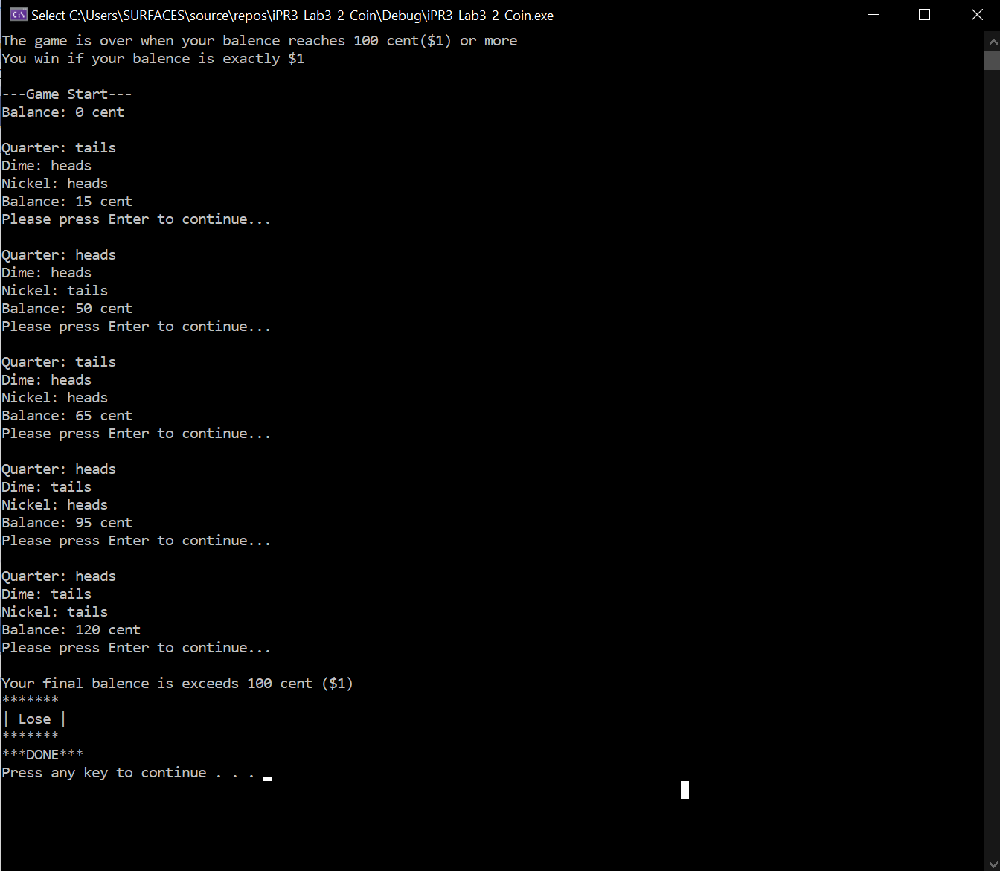

# Tossing-Coins-For-a-Dollar
When the game begins, your starting balance is $0. During each round of the game, the program will toss three (a quarter, a dime, a nickel) coins. When a coin is tossed, the value of the coin is added to your balence is it lands heads-up. 

For example, if the quarter lands heads up, 25 cents is added to your balance.

*******************************************
The game is over when your balance >= $1\
If your balance is exactly $1, you win the game.\
You lose if your balance exceeds $1.
********************************************

Developer: Fiavi Y.\
1/30/2021
